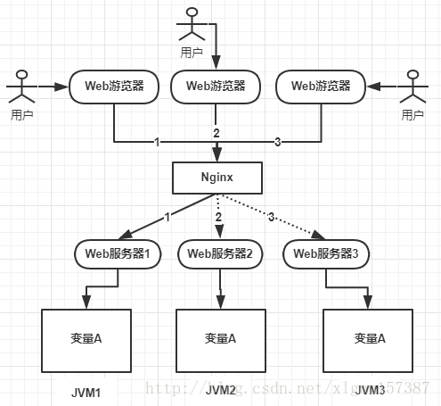
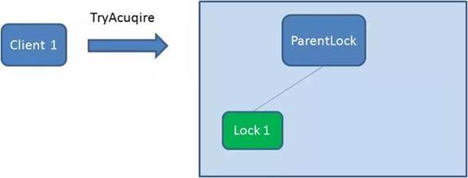
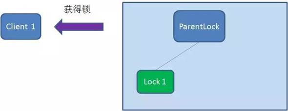
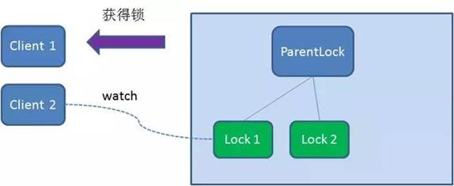
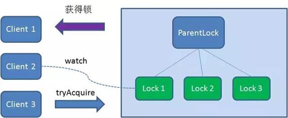
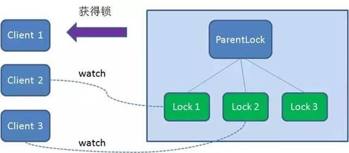
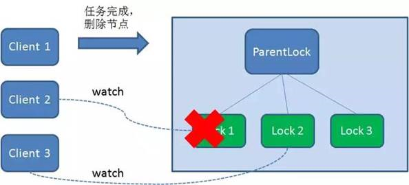
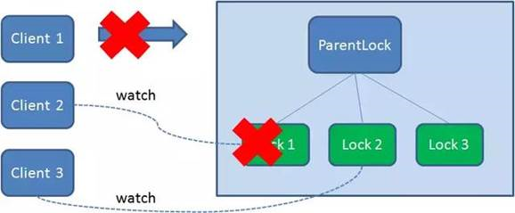
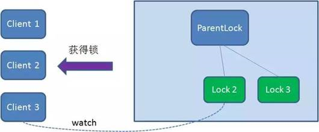
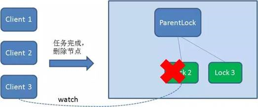

1.为什么用分布式锁

我们在开发应用的时候，如果需要对某一个共享变量进行多线程同步访问的时候，可以使用我们学到的Java多线程的18般武艺进行处理，并且可以完美的运行，毫无Bug！

 

注意这是单机应用，也就是所有的请求都会分配到当前服务器的JVM内部，然后映射为操作系统的线程进行处理！而这个共享变量只是在这个JVM内部的一块内存空间！

 

后来业务发展，需要做集群，一个应用需要部署到几台机器上然后做负载均衡，大致如下图：

 

上图可以看到，变量A存在JVM1、JVM2、JVM3三个JVM内存中（这个变量A主要体现是在一个类中的一个成员变量，是一个有状态的对象，例如：UserController控制器中的一个整形类型的成员变量），如果不加任何控制的话，变量A同时都会在JVM分配一块内存，三个请求发过来同时对这个变量操作，显然结果是不对的！即使不是同时发过来，三个请求分别操作三个不同JVM内存区域的数据，变量A之间不存在共享，也不具有可见性，处理的结果也是不对的！

 

如果我们业务中确实存在这个场景的话，我们就需要一种方法解决这个问题！

 

为了保证一个方法或属性在高并发情况下的同一时间只能被同一个线程执行，在传统单体应用单机部署的情况下，可以使用Java并发处理相关的API(如ReentrantLock或Synchronized)进行互斥控制。在单机环境中，Java中提供了很多并发处理相关的API。但是，随着业务发展的需要，原单体单机部署的系统被演化成分布式集群系统后，由于分布式系统多线程、多进程并且分布在不同机器上，这将使原单机部署情况下的并发控制锁策略失效，单纯的Java API并不能提供分布式锁的能力。为了解决这个问题就需要一种跨JVM的互斥机制来控制共享资源的访问，这就是分布式锁要解决的问题！

2.分布式锁的实现方式

2.1 基于数据库的实现

1.解决方式：设计一个独立的表结构来进行分布式锁信息的存储，在相对应获取锁的时候进行添加锁信息并持有锁，直到对应的业务操作结束之后进行锁的释放工作

2.设计实现：

方案一：

1. 表结构：

| 列名          | 类型          | 描述                   |
| ------------- | ------------- | ---------------------- |
| id            | bigint        | 主键                   |
| method_name   | varchar(64)   | 方法名，建立唯一性索引 |
| desc          | varchar(1024) | 备注信息               |
| update_time   | datetime      | 更新时间               |
| out_date_time | datetime      | 失效时间               |

 

2. 实现原理：

1.   获取锁：获取锁的时候，对象对表结构进行添加数据，用来标志锁信息。

2.   释放锁：删除对应的数据，标志锁的释放

方案二：

1.   表结构

| 列名          | 类型          | 描述                   |
| ------------- | ------------- | ---------------------- |
| id            | bigint        | 主键                   |
| method_name   | varchar(64)   | 方法名，建立唯一性索引 |
| desc          | varchar(1024) | 备注信息               |
| update_time   | datetime      | 更新时间               |
| version       | int           | 版本号                 |
| state         | int           | 状态：0未分配，1已分配 |
| out_date_time | datetime      | 失效时间               |

 

2.   实现原理

(1)  获取锁

①   第一次获取的时候，相对应表结构没有数据，则加入一条数据，state为1，version为1，代表锁

②   如果数据库表中有对应锁的数据，先判断是否为未分配的锁信息，如果是，更新数据为已分配状态。

(2)  释放锁：更新state状态为未分配代表释放锁

**3.** **存在问题：**

**1.** **数据库服务宕机的问题：数据库主从配置？**

**2.** **并发低，锁记录包含很多冗余信息**

2.2 基于redis的实现

2.2.1 基于redis的实现

1.命令介绍：

1.   setNX（SET if Not eXists）

将key的值设置为value，当且key不存在的时候

如果key存在，则setNX没有效果

2.   GETSET key value：将给key的值设为value，并返回key的旧值(old            value)。

3.   GET key：获取key对应的值

4.   EXPIRE key seconds:给定key设置生存时间，当生存时间到的时候，            key将被自动删除

实现方式：

1.       加锁：

采用redis中setNX的功能来进行锁信息的保存，进行持有锁的操作，其中锁key值为锁的名字，value采用uuid或者requestId来进行保存。当setNX成功之后，设定相对应的过期时间，来实现redis锁的自动释放功能

2.       解锁

(1)     超时自动解锁

(2)     手动解锁：当业务代码执行完毕之后，通过相对应的key进行原有的锁的获取，通过del进行删除动作。

**存在问题：**

**1．** **Redis****锁的****setNX****和****Expire****不是原子操作，可能会发生****setNx****执行成功之后应用宕机，导致死锁。（可行的解决办法，锁的值设置为过期时间，获取锁的时候，比对锁是否过期了，过期的锁用****GETSET****重新设值）**

2． **Redis****锁为了避免单点问题，需要做主备或者集群，当主设置完锁并且数据没有同步到备的时候，主挂掉了，备切换成为主，这个时候新的主里面是没有这个锁的，会有并发问题。（归根结底这个问题是由于****Redis****是****ap****模型导致的，于是引入了下面基于****cp****模型的分布式锁）**

2.2.2 借助工具类Redisson进行分布式锁开发

1.原理：Redisson锁的原理其实就是redis的实现方式，只是Redisson提供          了更方便的封装，让我们进行使用

2.redisson锁介绍

1.可重入锁（Reentrant Lock）

2.公平锁（Fair Lock）

3.联锁（MultiLock）

4.红锁（Red Lock）

5.读写锁（ReadWriteLock）

3.redisson分布式锁实现

1.加锁

1.通过redissonClient获取对应Rlock锁对象，然后根据Rlock提供的方法进行锁操作，具体Rlock提供的锁方法如下：

void lock(Long leaseTime,TimeUnit unit )        

boolean tryLock(Long waitTime,Long leaseTime,TimeUnit unit)

2.解锁

根据Rlock提供的unlock进行解锁

​                                   **存在问题：**

**1、**  **相较于简单的****Redis****锁，****redisson****锁种类更多，但是相应的需要依赖很多其他组件，比较重**

2、  **因为基于****ap****模型的****redis****，所以也存在数据不一致的问题**

2.3 基于zookeeper的实现

1.zookeeper节点四种类型：

1.持久节点（PERSISTENT）

2.持久顺序节点（PERSISTENT_SEQUENTIAL）

3.临时节点（EPHEMERAL）

4.临时顺序节点（EPHEMERAL_SEQUENTIAL）

2.实现原理：

**1.** **获取锁**

 

首先，在Zookeeper当中创建一个持久节点ParentLock。当第一个客户端想要获得锁时，需要在ParentLock这个节点下面创建一个临时顺序节点 Lock1。

 

之后，Client1查找ParentLock下面所有的临时顺序节点并排序，判断自己所创建的节点Lock1是不是顺序最靠前的一个。如果是第一个节点，则成功获得锁。

 

这时候，如果再有一个客户端 Client2 前来获取锁，则在ParentLock下载再创建一个临时顺序节点Lock2。

 

Client2查找ParentLock下面所有的临时顺序节点并排序，判断自己所创建的节点Lock2是不是顺序最靠前的一个，结果发现节点Lock2并不是最小的。

 

于是，Client2向排序仅比它靠前的节点Lock1注册Watcher，用于监听Lock1节点是否存在。这意味着Client2抢锁失败，进入了等待状态。

 

这时候，如果又有一个客户端Client3前来获取锁，则在ParentLock下载再创建一个临时顺序节点Lock3。

 

Client3查找ParentLock下面所有的临时顺序节点并排序，判断自己所创建的节点Lock3是不是顺序最靠前的一个，结果同样发现节点Lock3并不是最小的。

 

于是，Client3向排序仅比它靠前的节点Lock2注册Watcher，用于监听Lock2节点是否存在。这意味着Client3同样抢锁失败，进入了等待状态。

这样一来，Client1得到了锁，Client2监听了Lock1，Client3监听了Lock2。这恰恰形成了一个等待队列，很像是Java当中ReentrantLock所依赖的

 

**2.** **释放锁**

 

释放锁分为两种情况：

 

1.任务完成，客户端显示释放

 

当任务完成时，Client1会显示调用删除节点Lock1的指令。

 

2.任务执行过程中，客户端崩溃

 

获得锁的Client1在任务执行过程中，如果Duang的一声崩溃，则会断开与Zookeeper服务端的链接。根据临时节点的特性，相关联的节点Lock1会随之自动删除。

 

由于Client2一直监听着Lock1的存在状态，当Lock1节点被删除，Client2会立刻收到通知。这时候Client2会再次查询ParentLock下面的所有节点，确认自己创建的节点Lock2是不是目前最小的节点。如果是最小，则Client2顺理成章获得了锁。

 

同理，如果Client2也因为任务完成或者节点崩溃而删除了节点Lock2，那么Client3就会接到通知。

 

最终，Client3成功得到了锁。

 

​         **存在问题：**

**1.**      **写并发不高，因为zk写入数据的时候，是要过半节点写入成功才算写成功**

**2.**      **读并发相较于redis锁也有很大差距**

2.4 基于etcd的实现

​    <http://blogspring.cn/view/120>

 

2.5  基于consul的实现

<http://blog.didispace.com/spring-cloud-consul-lock-and-semphore/>

 
